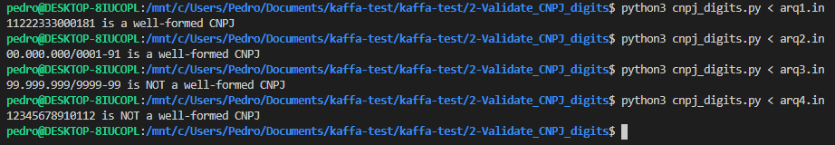

# 2) Validate CNPJ digits

### Python version
Python 3.8.2

### Running the code
```sh
$ python3 cnpj_digits.py
```
or
```sh
$ python3 cnpj_digits.py < arqX.in
```

### Screenshot:



### Some algorithm sources
<https://www.geradorcnpj.com/algoritmo_do_cnpj.htm>

<http://www.macoratti.net/alg_cnpj.htm>

<https://pt.wikipedia.org/wiki/Cadastro_Nacional_da_Pessoa_Jur%C3%ADdica#Algoritmo_de_Valida%C3%A7%C3%A3o>
