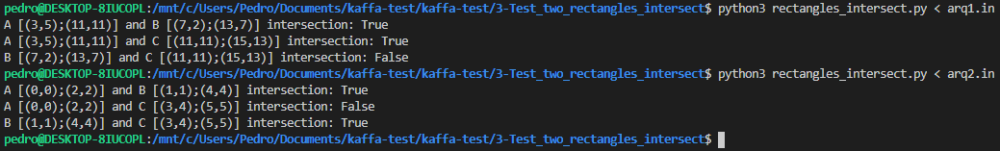

# 3) Test if two rectangles intersect

### Python version
Python 3.8.2

### Running the code
```sh
$ python3 rectangles_intersect.py
```
or
```sh
$ python3 rectangles_intersect.py < arqX.in
```

### Screenshot:

