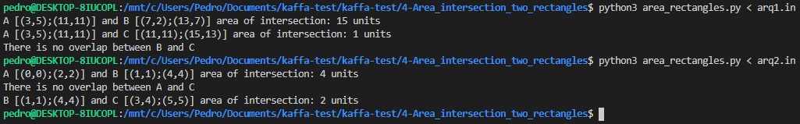

# 4) Compute area of intersection between two rectangles

### Python version
Python 3.8.2

### Running the code
```sh
$ python3 area_rectangles.py
```
or
```sh
$ python3 area_rectangles.py < arqX.in
```

### Screenshot:

