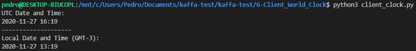

# 6) Rest Client - World Clock

### Python version
Python 3.8.2

### This program uses the Requests Library
<https://requests.readthedocs.io/en/master/user/quickstart/>

### Running the code
```sh
$ python3 client_clock.py
```

### Screenshot:

