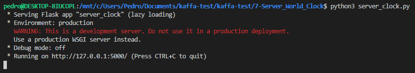
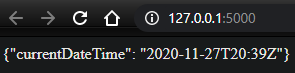

# 7) Rest Server - World Clock

### Python version
Python 3.8.2

### This program uses Flask
<https://flask.palletsprojects.com/en/1.1.x/installation/#installation>

### Running the code
```sh
$ python3 server_clock.py
```

### Screenshots:

### - Running the program


### - Accessing local URL


### - Can also use:
```sh
$ http://localhost:5000/
```